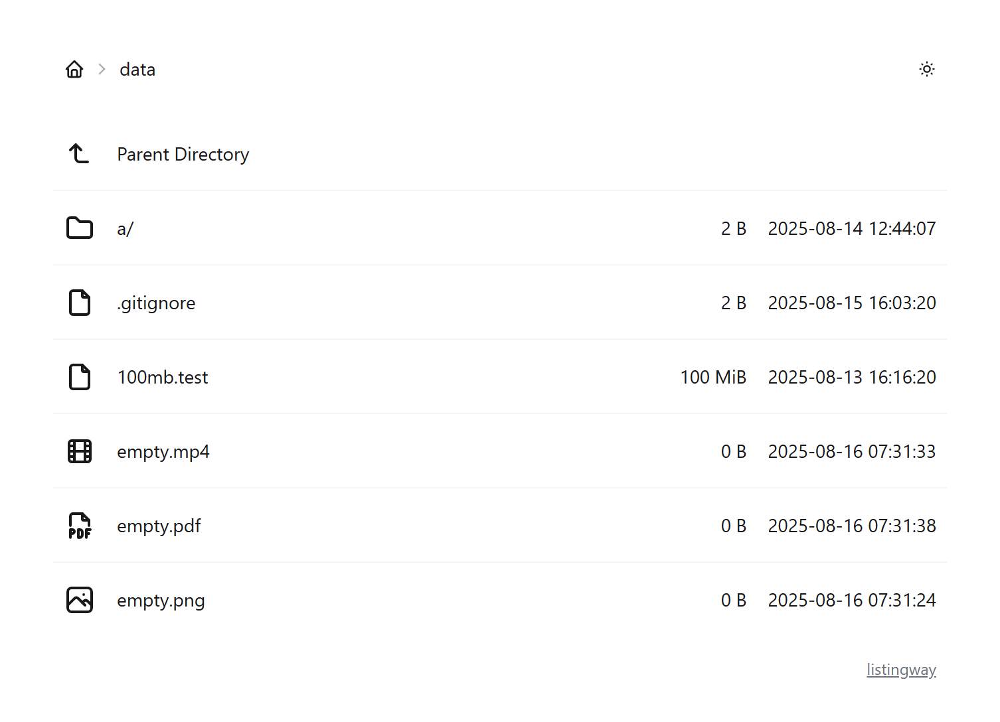

# listingway

<picture>
  <source media="(prefers-color-scheme: dark)" srcset="./promote/dark.webp" type="image/webp">
  <source media="(prefers-color-scheme: dark)" srcset="./promote/dark.png" type="image/png">
  <source media="(prefers-color-scheme: light)" srcset="./promote/light.webp" type="image/webp">
  <source media="(prefers-color-scheme: light)" srcset="./promote/light.png" type="image/png">
  
</picture>

Listingway is a [caddy file server browse template](https://caddyserver.com/docs/caddyfile/directives/file_server) which provides light and clean user interface. It also provides a parallel downloader which can accelerate download speed on some of network conditions.

[Try a live demo](https://oott123.github.io/listingway/) now! (Note: This static generated demo may not offering the full experience as caddy.)

## Features

- Dark mode / Light mode
- Parallel downloader
- Fully self-contained, no CDN resources

<picture>
  <source media="(prefers-color-scheme: dark)" srcset="./promote/dark_dialog.webp" type="image/webp">
  <source media="(prefers-color-scheme: dark)" srcset="./promote/dark_dialog.png" type="image/png">
  <source media="(prefers-color-scheme: light)" srcset="./promote/light_dialog.webp" type="image/webp">
  <source media="(prefers-color-scheme: light)" srcset="./promote/light_dialog.png" type="image/png">
  
</picture>

## Usage

Download the bundle from [releases](https://github.com/oott123/listingway/releases/latest) and upload to your server. Adds configuration below:

```caddy
file_server {
  root /usr/share/nginx/html
  browse /usr/share/nginx/listingway/index.html
}
handle /_listingway/assets/* {
  uri strip_prefix /_listingway/assets
  root /usr/share/nginx/listingway/assets
  file_server
}
```

Note that you should not change the `_listingway/assets` part in the `handle` and `uri` directives, or you should build your own bundle.

## FAQ

### No "Accelerated Download" button shown

You should only see the Accelerated Download button on the [supported browser](https://developer.mozilla.org/en-US/docs/Web/API/Window/showSaveFilePicker#browser_compatibility) under a [secure context](https://www.w3.org/TR/secure-contexts/).

This means **http** origins are not supported (use **https**!), except you are accessing from localhost.
